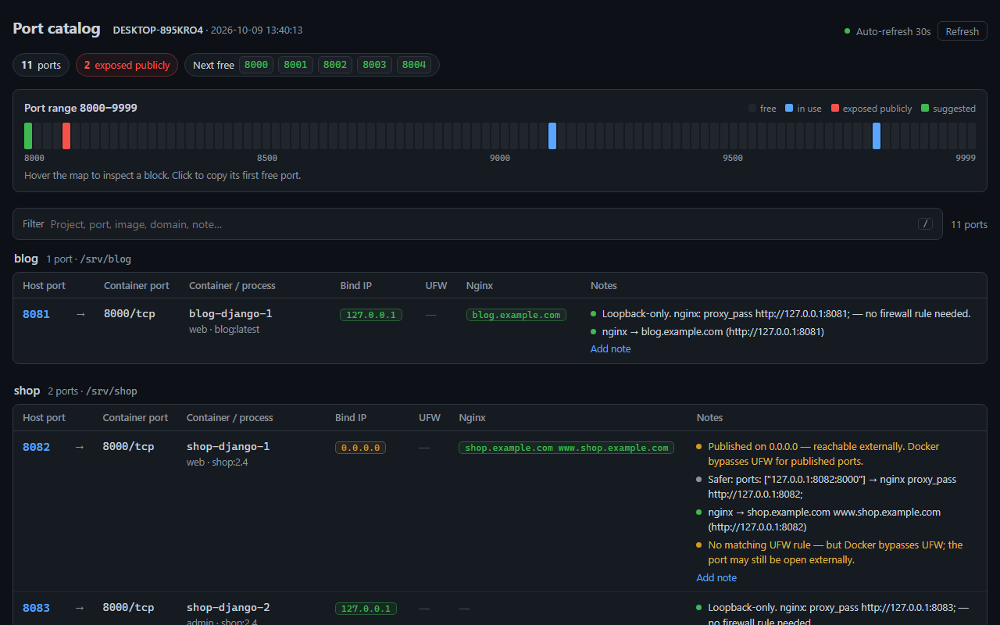

# port-catalog

**Which port is the blog on again?** A tiny, read-only tool that shows every listening and Docker-published port on a host: who owns it, whether it's public, and which host port is free next.



It merges Docker publish mappings (grouped by compose project), UFW rules, nginx `server_name` / `proxy_pass`, and host sockets with the process behind each one (nginx on 80, postgres on 5432). It also flags ports Docker publishes on `0.0.0.0`, which bypass UFW.

Web UI, JSON API and a one-shot CLI. No database, no CDN, works offline.

## Run it

```bash
docker compose up -d --build
ssh -N -L 9780:127.0.0.1:9780 user@server   # then open http://127.0.0.1:9780
```

No image? With [uv](https://docs.astral.sh/uv/) installed:

```bash
sudo ./run.sh          # serve the UI
./run.sh --once        # print the catalog and exit
./run.sh --demo        # try it with sample data, no Docker needed
```

CLI in Docker: `docker compose run --rm port-catalog python -m app.main --once --json /data/catalog.json`

## API

| Endpoint | |
|---|---|
| `GET /api/health` | `{"status": "ok"}` (never needs the token) |
| `GET /api/catalog` | full catalog, recomputed on every request |
| `POST /api/annotations` | `{"port": "8081", "text": "prod django"}`; empty text deletes the note |

## Configuration

| Variable | Default | Meaning |
|---|---|---|
| `PORTCATALOG_BIND` | `127.0.0.1` | bind address |
| `PORTCATALOG_PORT` | `9780` | port; also excluded from suggestions |
| `UFW_DIR` | `/etc/ufw` | host UFW config mount |
| `NGINX_DIR` | `/etc/nginx` | host nginx config mount |
| `DATA_DIR` | `/data` | where `annotations.json` is stored |
| `PORT_RANGE_START` / `PORT_RANGE_END` | `8000` / `9999` | range for suggestions and the port map |
| `PORTCATALOG_TOKEN` | unset | if set, `/api/catalog` and `/api/annotations` need `Authorization: Bearer <token>` |

If UFW or nginx aren't mounted the app still runs; the missing source shows up as a red chip.

## Security

- **docker.sock is root.** `:ro` only makes the socket file read-only, not the API. For hardening, point `DOCKER_HOST` at a read-only [docker-socket-proxy](https://github.com/Tecnativa/docker-socket-proxy) (`CONTAINERS=1` only). The container runs as root because the socket requires it.
- **Docker bypasses UFW.** A port published on `0.0.0.0` can be reachable with no UFW allow rule. Prefer `ports: ["127.0.0.1:8081:8000"]` plus `proxy_pass http://127.0.0.1:8081;`. Never use container IPs as upstreams; they change on recreate.
- **Don't expose the UI publicly.** It lists your attack surface. It binds `127.0.0.1` by default; use an SSH tunnel.
- `pid: host` in the compose file lets it read `/proc/<pid>/fd` to name host processes. Remove it and ports fall back to a guess from the port number.
- The only file written is `$DATA_DIR/annotations.json`.

## Development

```bash
pip install -r requirements.txt -r requirements-dev.txt
python -m pytest
python -m app.main --demo
```

MIT licensed.
